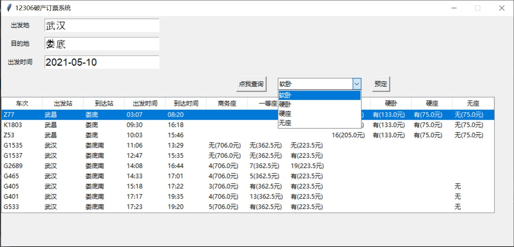

# 爬取12306车票信息并模拟预定操作

### 1、操作介绍

在相应文本框中输入出发地、目的地、出发时间（如2021-05-09），点击查询按钮，下方的文本框中会输出车次信息，在文本框中用鼠标单击选择车次，会出现所有能选择的票席种类组成的下拉列表，选择票席，点击预定，订票信息就会被存储到excel文件中。

- 

### 2、各个文件介绍

#### city.py

city.py用来获取12306的城市码，12306的车站查询有一个特殊的城市（车站）码机制，需要爬取到车站码才能查询到相应的车票信息。

#### train.py

train.py调用city.py获得车票码，从12306后台API爬取车票信息，该信息返回的是一个json字符串，然后解析json字符串获取需要的信息，另外，还要调用price.py来解析其中存储票价的代码。

#### price.py

用来解析json中存储票价的代码，从而获取票价信息。

#### main.py

主程序，用tkinter设计GUI界面，实现具体功能。

